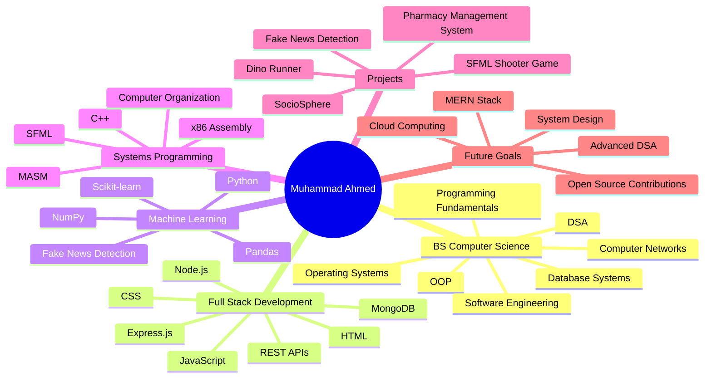

---

👨‍💻 About Me

I'm Muhammad Ahmed, a passionate BS Computer Science Student focused on building software that solves real-world problems.

My interests include:

🌐 Full-Stack Web Development
📰 Machine Learning & AI
💻 System Programming
🗄 Database Systems
🎮 Game Development
📚 Data Structures & Algorithms
⚡ Problem Solving
🚀 Building Practical Applications

# 🚀 Featured Projects

<table>
<tr>
<td width="50%">

## 🌐 SocioSphere

A full-stack social networking platform featuring:

User authentication
User profiles
Post creation & interactions
Community engagement
Modern responsive UI

**Tech:** Node.js, Express.js, MongoDB, JavaScript, Bootstrap
</td>
<td width="50%">

## 📰 Fake News Detection System

Machine learning application that predicts whether news content is real or fake.

NLP preprocessing
Dataset training
Feature extraction
Prediction engine
Classification models

**Tech:** Python, Pandas, NumPy, Scikit-learn
</td>
</tr>

<tr>
<td width="50%">

## 🏥 MEDIVAULT

Secure digital healthcare record management system.

🔐 OTP-Based Secure Authentication
📋 Medical Records Management
👨‍⚕️ Doctor & Guest Doctor Access
📅 Appointment Booking System
🛡️ Admin Dashboard & Access Monitoring

**Tech:** React.js,Tailwind CSS,ASP.NET Core Web API,PostgreSQL,Entity Framework Core

</td>
<td width="50%">

## 💊 Pharmacy Management System

Complete pharmacy ERP solution.

Inventory management
Billing system
Purchase tracking
Customer management

**Tech:** JavaScript, Express.js, MongoDB

</td>
</tr>
</table>>

# 🛠 Tech Stack

### Languages

### Frontend

### Backend & Database

---

# 📈 GitHub Analytics

---

---

# 🧠 Current Learning Roadmap

# 🐍 Contribution Snake

---
# 🔍 Professional Keywords

`Full-Stack Developer`
`Automation Engineer`
`Python Developer`
`Node.js Developer`
`Playwright Automation`
`Web Scraping`
`MongoDB`
`AI Systems`
`CRM Development`
`Business Automation`
`Logistics Software`
`SaaS Development`
`Data Extraction`
`.NET`
`C++`
`DSA`
`MASM x8086`

---

## ⚡ Building systems that automate workflows and solve real-world business problems.

